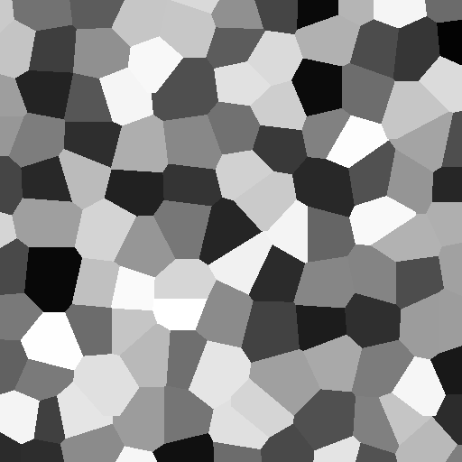

# Examples

The provided script, [`generate_pngs.dart`](./generate_pngs.dart) uses this
library combined with `package:image` to generate the following images for each
pattern function:

## `Checkerboard`

## `White`

## `Value`

## `Perlin`

## `Simplex`

## `Worley.distance`

## `Worley.value`

